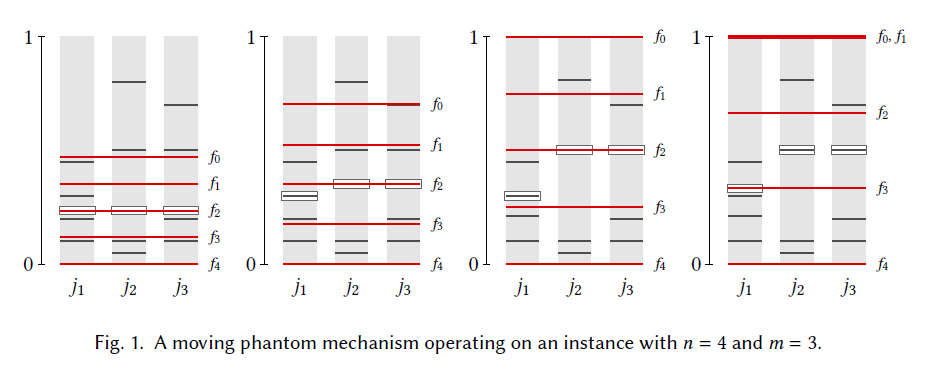

# Introduction
This repository contains code to run simulations and visualization of study in Budget Proposal Aggregation (https://en.wikipedia.org/wiki/Budget-proposal_aggregation).

I would try to keep the explanation as simple as possible, but if you are curious, please refer to the influencial paper published by Freeman et al. (2021): https://arxiv.org/abs/1905.00457 or my own paper: [to be summited ;P]

## Repository Structure

- `fyp_functions.py`: Contains the core functions to run my simulations and visuaization.
- `main.ipynb`,`topic_1.ipynb`,`topic_2.ipynb`: Simluation and experiment playground
- `Old/`: Old code kept as reference 
- `README.md`: Project overview and introduction.

# Brief Research Introduction
Participatory budgeting is a democratic process that empowers citizens to vote on the allocation of public funds within their communities, such as municipalities, towns, or neighborhoods. Unlike traditional representative democracy, PB invites citizens to engage directly in budgetary decision-making, reducing corruption while fostering inclusivity, particularly for marginalized and historically underrepresented groups. Originally developed in Brazil in 1989, it has since spread widely across Latin America, North America, and Europe.

One of the main focus of study centered around budget proposal aggregation named 'Independent Market Mechanism' (IMM).

## Indenpendent Market Mechanism (IMM)
Let's say we have n voters and m projects, and all voters submit an allocation of budget. For example, voter A submit an allocation of [0.8,0.2], meaniing that voter A prefers to allocate 80% of the budget to project 1 and 20% to project 2.

 When we only have two alternatives (m=2), a great way to decide the outcome is to pick the median of all the n votes & n+1 phantoms, where phantoms are placed uniformly between 0 and 1. The reason that a phantom system is preferred instead of simply taking the mean or median is because it is proportional and truthful (out of the scope of this markdown).

The issue with this method is that at m>2, the median of the phantom systems will not neccessarilly add up to 1. Recall that this is an allocation of budget so we need the final allocation (ie, all of the medians in phantom system) to add up to 1.

IMM could solve this issue by normalizing the outcome. Instead of placing phantoms uniformly, we placed them dynamically according to the votes, where we move the phantoms continuously from 0 to 1, until the sum of the medians is 1.

To build intuition, we consider an example moving phantom mechanism, shown in Figure 1.
There are three alternatives, each occupying a column on the horizontal axis, and four voters. Voter
reports are indicated by gray horizontal line segments, with their magnitude 𝑝ˆ𝑖, 𝑗 indicated by their vertical position. The phantom placements are indicated by the red lines and labeled 𝑓0, . . . , 𝑓4. For each alternative, the median of the four agent reports and the five phantoms is indicated by a rectangle.

The four snapshots shown in Figure 1 display increasing values of 𝑡.Observe that the position
of each phantom (weakly) increases from left to right, as does the median on each alternative.
Although the vertical axis is not labeled, for simplicity of presentation, normalization here occurs
in the second image from the left. In the leftmost image, the sum of the highlighted entries is less
than 1, while in the two rightmost images it is more than 1.

## Indenpendent Market Mechanism (IMM)